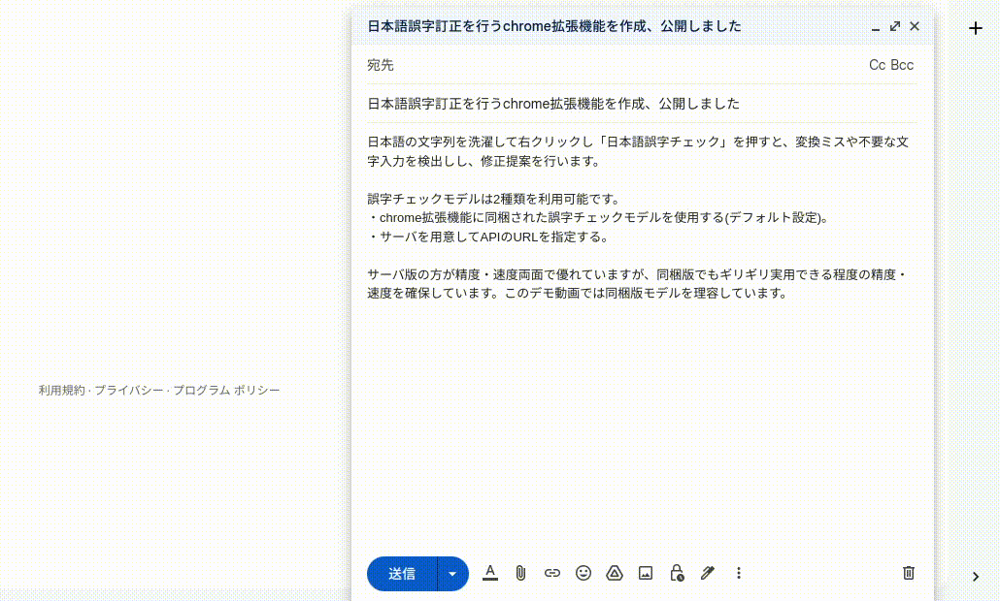

# Chrome拡張機能 日本語誤字チェック

chromeウェブストアで[入手](https://chrome.google.com/webstore/detail/%E6%97%A5%E6%9C%AC%E8%AA%9E%E8%AA%A4%E5%AD%97%E3%83%81%E3%82%A7%E3%83%83%E3%82%AF/kimgghbenifpmkblkhngkbbgkdaaggmc?hl=ja)できる、日本語の誤字チェック・訂正提案を行うChrome拡張機能。



## 利用方法

* ページ内で文字列を選択し、右クリックで開いたコンテキストメニューから「日本語誤字チェック」を押す。選択した文字列に対して誤字チェックが行われる。
* ページ内で文字列上を右クリックし、コンテキストメニューから「日本語誤字チェック」を押す。カーソル周辺の文字列が自動的に選択され、選択された文字列に対して誤字チェックが行われる。

## ライセンス

### 拡張機能に同梱する誤字チェックモデル

CC-BY-SA 3.0

* 校正の学習データとして、[京都大学黒橋・褚・村脇研究室](https://nlp.ist.i.kyoto-u.ac.jp/)により作成された[日本語Wikipedia入力誤りデータセット (v2)](https://nlp.ist.i.kyoto-u.ac.jp/?%E6%97%A5%E6%9C%AC%E8%AA%9EWikipedia%E5%85%A5%E5%8A%9B%E8%AA%A4%E3%82%8A%E3%83%87%E3%83%BC%E3%82%BF%E3%82%BB%E3%83%83%E3%83%88)を使用しています。
* 校正モデルは[albert-japanese-tinysegmenter](https://github.com/nknytk/albert-japanese-tinysegmenter)の事前学習済みwordpiece mediumモデルをファインチューニングして作られています。事前学習済みモデルはWikipediaのデータで学習されています。

### TinySegmenter

(c) 2008 Taku Kudo <taku@chasen.org>

[New BSD License](http://chasen.org/~taku/software/TinySegmenter/LICENCE.txt)

* 分かち書きを行うモジュールとして[TinySegmenter](http://chasen.org/~taku/software/TinySegmenter/)を利用しています。

### ONNX Runtime Web

Copyright (c) Microsoft Corporation

[MIT License](https://github.com/microsoft/onnxruntime/blob/main/LICENSE)

* モデル実行ライブラリとしてONNX Runtimeを利用しています。

### その他の部分

MIT Licesence

Copyright (c) 2023 Yutaka Nakano

```
Permission is hereby granted, free of charge, to any person obtaining a copy
of this software and associated documentation files (the "Software"), to deal
in the Software without restriction, including without limitation the rights
to use, copy, modify, merge, publish, distribute, sublicense, and/or sell
copies of the Software, and to permit persons to whom the Software is
furnished to do so, subject to the following conditions:

The above copyright notice and this permission notice shall be included in all
copies or substantial portions of the Software.

THE SOFTWARE IS PROVIDED "AS IS", WITHOUT WARRANTY OF ANY KIND, EXPRESS OR
IMPLIED, INCLUDING BUT NOT LIMITED TO THE WARRANTIES OF MERCHANTABILITY,
FITNESS FOR A PARTICULAR PURPOSE AND NONINFRINGEMENT. IN NO EVENT SHALL THE
AUTHORS OR COPYRIGHT HOLDERS BE LIABLE FOR ANY CLAIM, DAMAGES OR OTHER
LIABILITY, WHETHER IN AN ACTION OF CONTRACT, TORT OR OTHERWISE, ARISING FROM,
OUT OF OR IN CONNECTION WITH THE SOFTWARE OR THE USE OR OTHER DEALINGS IN THE
SOFTWARE.
```
